# dotfiles

My dotfiles and configs for CachyOS Hyprland. I keep things pretty simple and minimal, nothing fancy. My main priority has been keeping a unified workflow across nvim, tmux and hyprland. As someone who spends a very large amount of time on their laptop for work (local and remote), that's super important to me. Hyprland sometimes gets this rap of being more eye candy. While I admit it's easy to go down that path, I've kept things very functional and oriented to supporting long hours of constant work.

When looking at dotfiles online, I noticed many following an all-or-nothing approach to others adopting their files. I don't really like that philosophy, I think it's better to be able to pick and choose what you want to use from different sources. In that spirit, I've kept things in this repo to be _as_ modular as possible. Piece by piece, you can take from here what you like. In addition to making this repo easier to maintain for me, I think it also allows you to learn more about building and customizing your own Arch setup.

I think I've done a good job at the unified workflow aspect. At least, I've come to the point where it's all in my muscle memory now, and I don't really work with any other setup. As we all know how ricing goes, though, this is a constantly evolving repo. We'll see what changes come my way, especially since I'm using Hyprland lol. My scripting (and life enjoyment) has gone up significantly since I kicked Windows out of my life. Interesting feeling to be studying comp arch and OS alongside doing all this.

Putting aside tmux for a second (I only use it for persistent remote sessions), consider the completely unified workflow between nvim and Hyprland. It's all lua, and I've grown to really like the language! Very happy with my terminal environment. I honestly use nvim more than Zed. It's a really nice feeling to have such a nice custom setup.

> [!NOTE]
> Just to give an update. As much as it took me time to setup waybar, I'm happy to say my transition to Quickshell is well underway! It'll be a while before you see any of it here, and for good reason. It's essentially set to replace everything from mako and hyprlock to, of course, waybar. But I'm still learning.
> 
> I don't think I'm going to share much before it's ready, though. This is a busy time and I'm going to build slowly.
> 
> Fun times!

I'm proud of my waybar even if it's soon to be legacy, it's sleek and not distracting. Gives me all the info I need and doesn't clutter the bar. Took me a couple days to get right. That and my nvim setup are prob my peak design skills (which may not be saying much). My weak point is the colors for sure, whether it comes to the waybar, notifications, or the whole general experience. I'm colorblind so setting it up right is hard (and lowkey not high priority for me lol).

The best part about using an Arch-based distro with Hyprland is that you have to build pretty much everything. CachyOS gave me a huge advantage of performance upgrades out of the box. I had to then write configs for key binds, color schemes, notifications, wallpapers, app menu, the status bar, etc. Stuff like opening certain applications needed scripts and desktop files. Everything from screenshots to displaying battery and adjusting volume needed scripts! So it did feel like I was doing a good amount of building. The credit for this is definitely shared by CachyOS and Hyprland. Quickshell is about to join and make a goated trio :)

> [!TIP]
> When creating your own build, it's definitely worth using the help of AI. I'm a basic Gemini user and relied on AI assisted debugging and development a fair amount at the start. Soon enough the vision was in my head and I stopped needing it. AI does help a lot, but more important is reading the tool manuals lol.
> 
> Regardless, I think it's a new tool one can make use of! The Linux community is understandably skeptical, but I think it's great help for personal use. It is my strong opinion that resisting AI now is like resisting Google in 2000.
> 
> I more recently integrated Copilot and Claude Code into my nvim setup, it's been a game changer for sure.

Building everything like this and setting up distroboxes, ephemeral podmans, and background services did teach me a lot about how my system works. Overcoming challenges like setting up fingerprint auth and a hibernation swapfile were def learning experiences. My biggest challenge was probably putting together an actually stable [yaml file](system/ov10a10.yaml) for my IPU6 camera being used by libcamera. The more I learnt, the more I realised what was possible. Ricing is a fun place to spiral down, I do hope I can give back to the open source community someday.

Hope you like it! Look below for pics of my desktop. (Legacy system Waybar, Mako, Hyprlock for now).

> [!CAUTION]
> I'm on Arch, btw

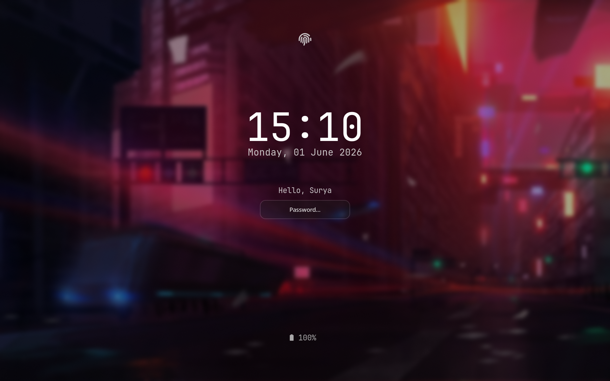
 
*Lock Screen*

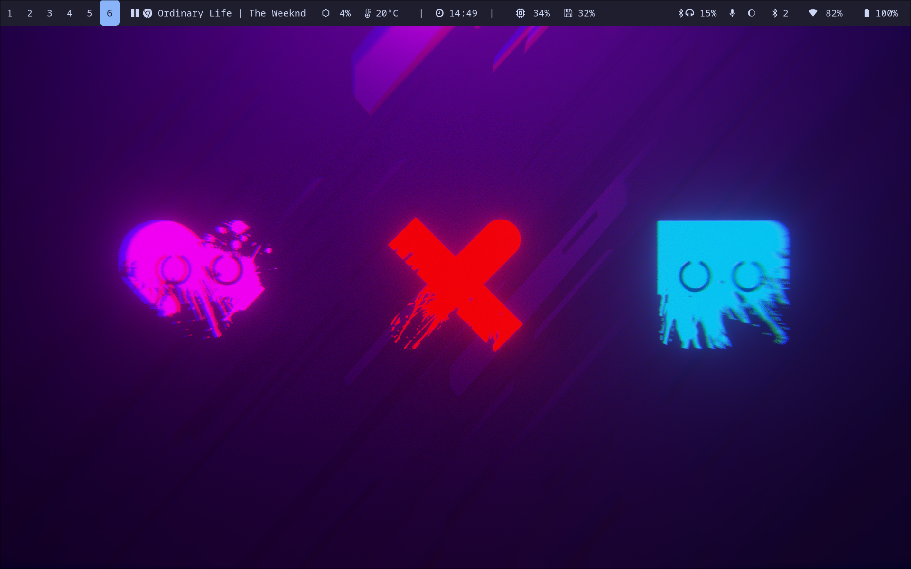
 
*Home Screen*

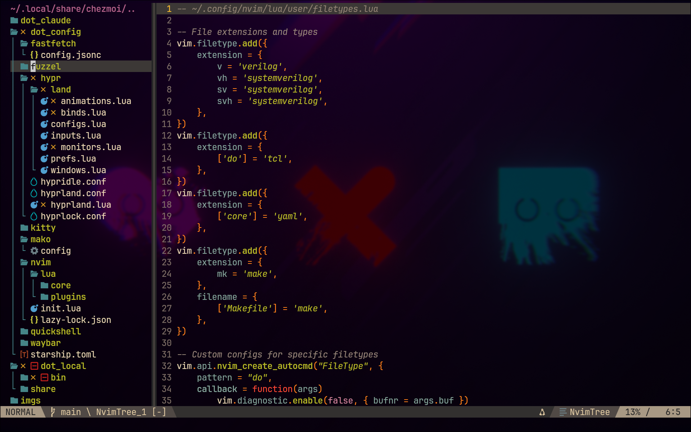
 
*Neovim Tree*

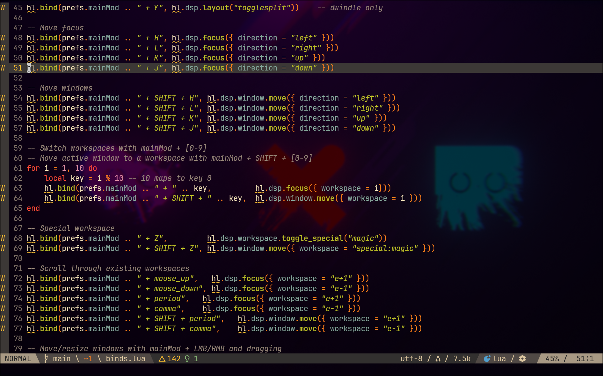
 
*Neovim Home*

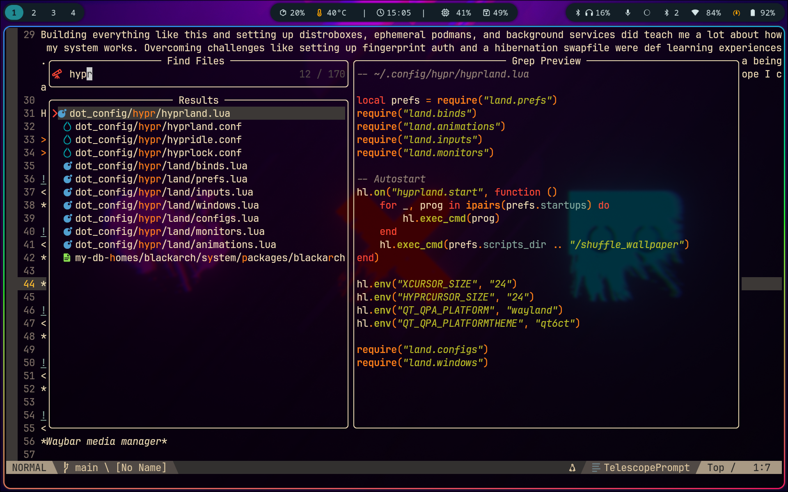
 
*Neovim Telescope*

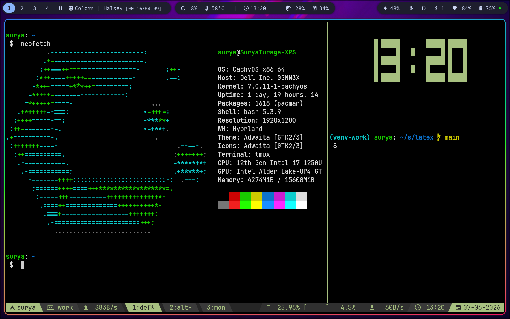
 
*My tmux workspace*

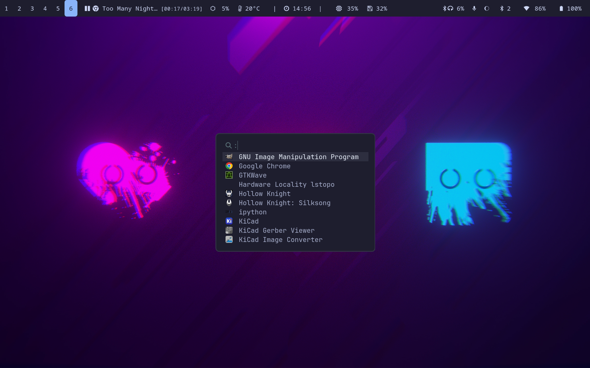
 
*Fuzzel App Menu*

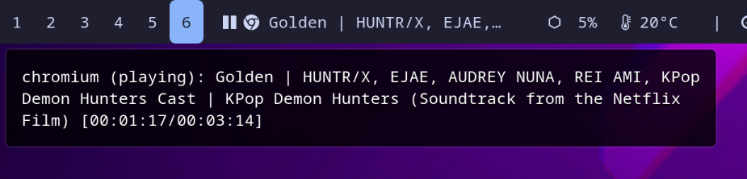
 
*Waybar media manager*

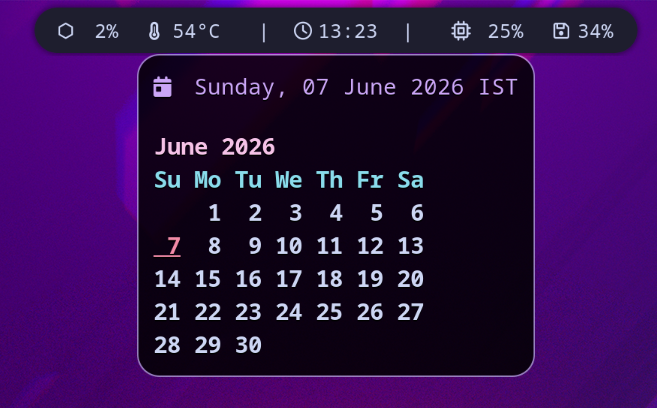
 
*Waybar calendar popup*

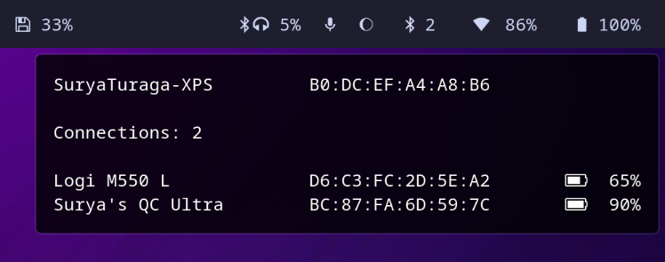
 
*Waybar bluetooth menu*

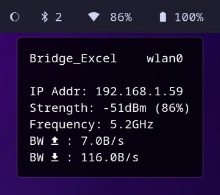
 
*Waybar WiFi menu*

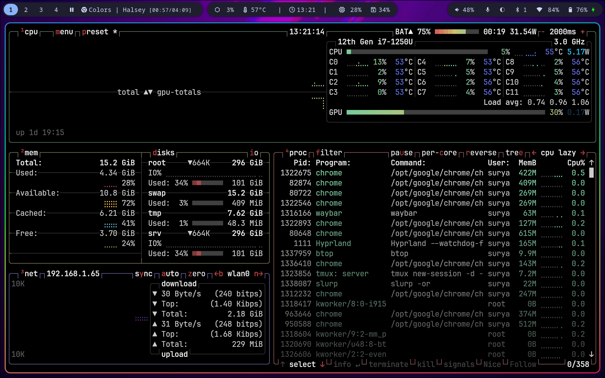
 
*btop*

Surya Turaga
